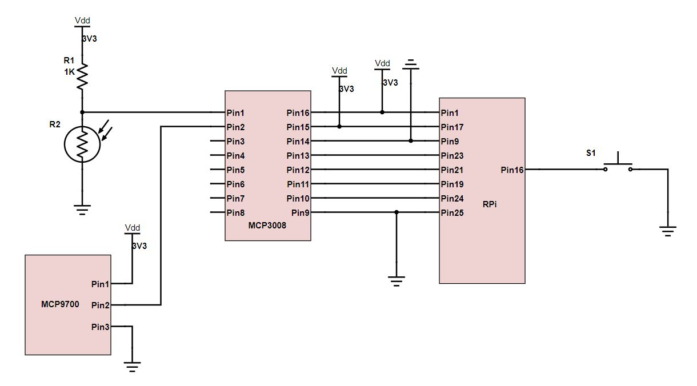

# Introduction

This script runs the ADC tests for the circuit connected to the Raspberry Pi Zero W as shown below. 



# Setup

Follow the below steps to install the relavent dependancies 

```bash

$ sudo apt-get update
$ sudo apt install build-essential python3-dev python3-smbus python3-pip
$ sudo pip3 install adafruit-circuitpython-mcp3xxx

```

Upon installing the dependacies run the script as follows

```bash

$ python3 test.py

```

Experiment with circuit and see values change